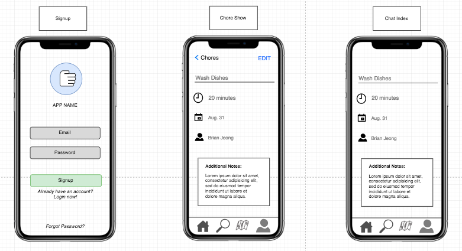
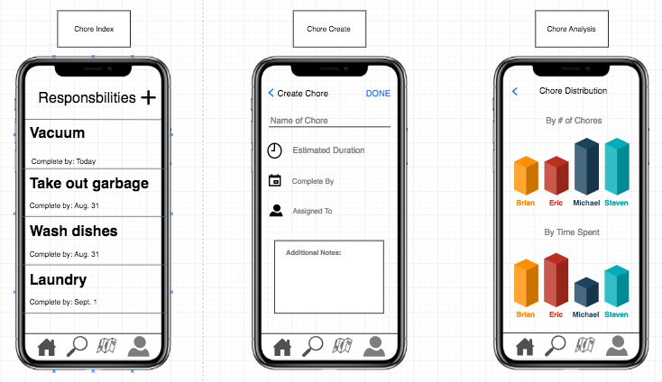

# TaskTracker
### Background
TaskTracker is a MERN-based website that aims to delegate responsibilities between housemates and provide an outlet to express comments and suggestions to one another anonymously. Living with others can be difficult, but TaskTracker makes it easy to ensure everyone does their part.

### Functionality & MVP
With this application, users will be able to:
+ Create a list of weekly responsibilities that can be randomly delegated
+ Participate in an anonymous group chat and post photos to highlight certain issues
+ Private messaging between members in your house
+ Track stats and visualize the distribution of responsibilities
+ Chat with other neighbors living near or around you

### Technologies & Technical Challenges
+ MERN stack - MongoDB, Express, React, Node
+ HTML/CSS
+ mLab/AWS cloud hosting
+ D3
+ Web-sockets

### Wireframes

This application will be implemented using the MERN stack (MongoDB, Express.js, React.js, Node.js) for a dynamic and user oriented experience. Express.js and Node.js on the back-end permits easy data storage and fetching through custom APIs routes. Additionally, MongoDB and Mongoose allows for a versatile interface with the database by extracting out the complex SQL document-style requirements. React serves as the front-end and enables a modular and unidirectional data flow to enhance the speed of our application.

In addition to the manifest.json and package.json files, there will be two scripts:
+ content.js: will contain the logic for listing and delegating responsibilities 
+ options.js: will contain the logic for changing the user's settings

There will also be two HTML files to display the content:
+ new_style.css: the file containing the styling rules for recoloring
+ options.html: the file that renders the Settings menu for the user

The primary technical challenges will be:
+ Determining a simplified group experience to make delegation of tasks and chores easy
+ Creating and managing web-sockets for seamless peer to peer chat
+ Intuitive visual breakdown of responsibilities

Things we accomplished this weekend:

+ Went over tutorials for the MERN stack and familiarize ourselves with how to build an application
+ The team also started the skeleton of the project and started the developmental version of the application

### Group Members & Work Breakdown

Our group consists of four members: Brian Jeong, Eric Tran, Michael Park and Steven Chen. Each member will handle both the frontend and backend of a feature.

Brian’s primary responsibilities will be:
+ Tasks

Eric’s primary responsibilities will be:
+ User auth and home page

Michael’s primary responsibilities will be:
+ Chat/messages

Steven’s primary responsibilities will be:
+ Groups

## Implementation Timeline

### Phase 1: Learn Technologies (2 days)
* Objective: All group members will be responsible for learning the MERN stack (MongoDB, Express, React, Node)
* By the end of the weekend, we will have completed the proposal README

### Phase 2: Functional App (3 days)
* Phase 2A: User Auth (Eric) (2 days)
  * Objective: Set up frontend and backend user auth through React and Node
  * By the end of Day 3, users will be able to signup and login, then stay logged in until logged out.
* Phase 2B: Home Page (Eric) (1 day)
  * Objective: Set up a functional home page with intuitive navigation to other features
  * By the end of Day 4, users will see their home page upon login. This home page will show the user's groups, tasks, and chats.
* Phase 2C: Group (Steven), Task (Brian), and Chat (Michael) Backend CRUD (1 day)
  * Objective: Set up backend routes and CRUD actions for groups, tasks, and chat
  * By the end of Day 4, users will be able to create, edit, and delete groups, tasks, and chats
* Phase 2D: Group (Steven), Task (Brian), and Chat (Michael) Frontend Display(2 days)
  * Objective: Set up containers and components for each feature
  * By the end of Day 4, users will be able to see their own groups, tasks, and chats

### Phase 3: Fleshing out MVPs (4 days)
* Phase 3A: Finish Home Page with proper styling and layout (Eric) (1 day)
  * Finish home page styling and layout
* Phase 3B: Finish groups with sliding modal and styling (Steven) (2 days)
  * List the user's groups
  * Expand on a group on click, showing the group name and all tasks
* Phase 3C: Finish tasks with pop-up modal and styling (Brian) (2 days)
  * Display task information like description and deadline
  * Clicking on a task will open this modal
* Phase 3D: Group messaging w/socket.io (Michael) (4 days)
  * Features include:
    * Photos
    * Database for message storage
    * Anonymous posting
* Phase 3E: Chore Analysis (Eric, Brian, Steven) (2 days)
  * Features include:
    * Stats tracking
    * Visualization of chore distribution/responsibilities
    * Reminders for those falling behind or those who regularly fail to meet deadlines

